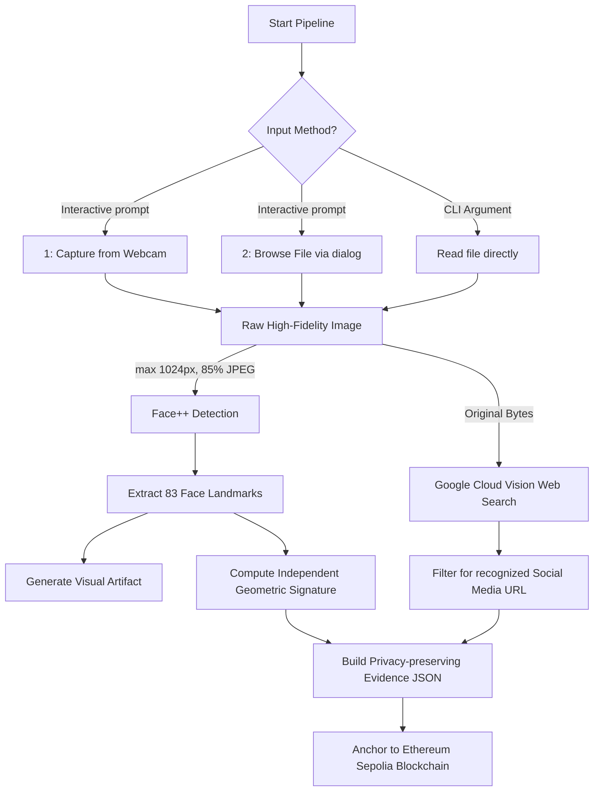

# FaceChain — Face ID + Blockchain Verification

FaceChain is a CLI pipeline that takes a photo, detects and encodes its face,
finds an actually indexed matching social-media page using reverse-image search,
and anchors the result to a public blockchain.

It does **not** contain hardcoded search results. A run fails honestly if Google
does not return an indexed social post for that image.

## What happens end to end


1. **Face ID:** Face++ Detect uploads the compressed input, requires exactly one detected
   face, and returns 83 facial landmarks. FaceChain computes an independent mathematical 
   encoding of those ordered landmarks. Only hashes of that vector and the provider token 
   are kept; raw biometric data is discarded. A visualization of the detected landmarks is also generated.
   *(Note: Images sent to Face++ are compressed to meet API size limits. This does not impact accuracy, as facial recognition relies on relative geometric proportions which remain invariant across compression levels.)*
2. **Reverse-image search:** Google Cloud Vision Web Detection searches the
   public web from the original, high-fidelity image bytes. FaceChain accepts only a URL from Google's
   `pagesWithMatchingImages` response whose domain is a recognized social site.
3. **Evidence:** The input hash, hashed face token, face geometry, provider,
   result URL, and timestamp become canonical JSON.
4. **Blockchain:** The evidence SHA-256 is written into a zero-value transaction
   on **Ethereum Sepolia** (chain ID `11155111`). The signed transaction calldata
   is immutable, publicly inspectable, and does not expose the photo or biometric
   token. `verify` downloads the transaction and recomputes the commitment.

## Setup

Prerequisites: Python 3.10–3.14, a Face++ account, a Google Cloud project with
Vision API enabled, and a Sepolia wallet containing a small amount of test ETH.

```bash
python3 -m venv .venv
source .venv/bin/activate
pip install -r requirements.txt
cp .env.example .env
```

Fill `.env`. Never commit it or expose it in a recording. Use a disposable
test-only wallet; never use a wallet containing real assets. Public Sepolia RPC
URLs are available from common Ethereum node providers, and test ETH is available
from Sepolia faucets.

Use a photo that is already present in a public, indexed social post, then run:

```bash
# Run interactively (will prompt to use Webcam or browse for a file)
python -m facechain.cli run --dry-run
python -m facechain.cli run

# Or provide a file path directly
python -m facechain.cli run ./demo/person.jpeg

# Verify the evidence
python -m facechain.cli verify ./artifacts/evidence-XXXXXXXXXXXX.json
```

The `--dry-run` command executes face detection, face encoding, genuine reverse
search, social-result validation, evidence generation, and deterministic hashing.
It stops before signing or broadcasting, so it spends no SepoliaETH. Use the
normal command once for the final recorded end-to-end blockchain proof.

The run prints the matched post, evidence hash, transaction hash, and Etherscan
URL. Open the Etherscan link during the demo and show the transaction input.

## Verified live proof

The pipeline completed successfully against the real external services on
September 5, 2026:

- Face++ detected one face and returned 83 landmarks (166 encoded dimensions).
- Google Vision Web Detection returned a matching public Instagram post.
- Evidence SHA-256: `78caf7a3d6bde2cdcc7c203e71ecd214643c3d738d0fbc91af150bba07c3db4d`.
- Independent `verify` output returned `VERIFICATION SUCCESSFUL`.

[View the Sepolia transaction](https://sepolia.etherscan.io/tx/a1dd6c72eeea32ed8908fc5e1e69532fefab9791497e2dafc7c24641f1e21b48)
or inspect the committed evidence [`artifacts/evidence-78caf7a3d6bd.json`](artifacts/evidence-78caf7a3d6bd.json)
and the landmark visualization [`artifacts/landmarks-78caf7a3d6bd.jpg`](artifacts/landmarks-78caf7a3d6bd.jpg).
The portrait itself is intentionally excluded from Git because it contains
biometric data.
permission. A face match is probabilistic biometric
evidence, not identity proof. Do not use this prototype for surveillance,
employment, credit, policing, or other high-impact decisions.
